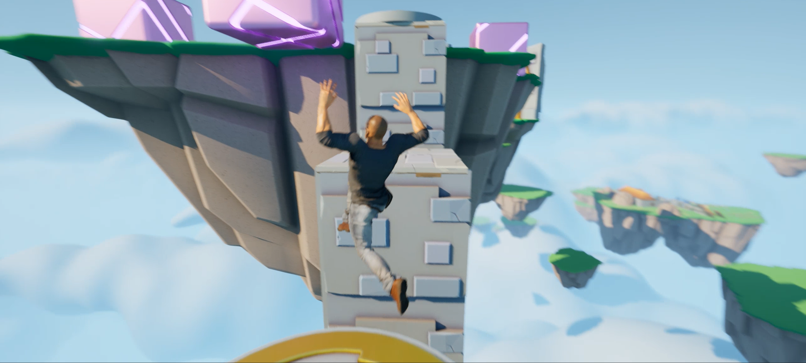
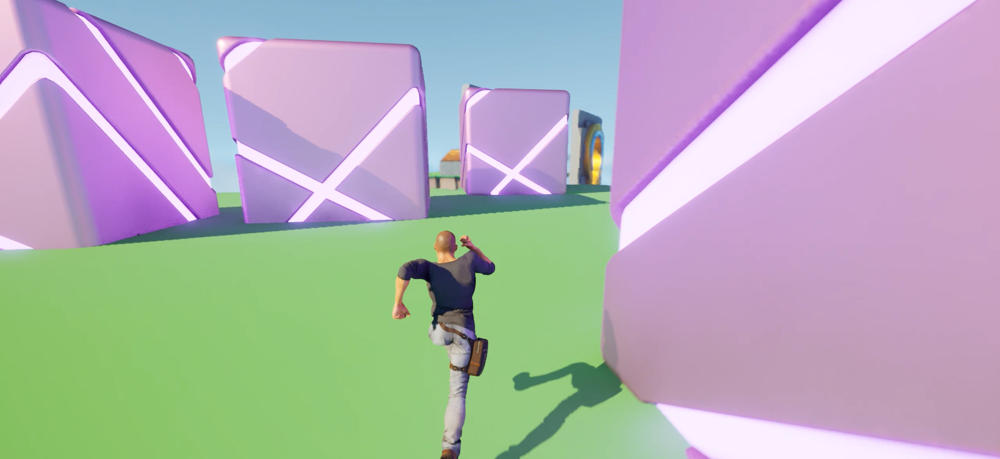
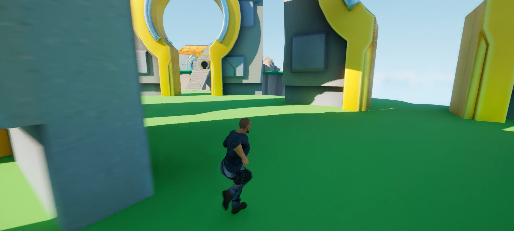

# 🌀Pass The Traps

Step into the shoes of a bold and stylish hero on a thrilling platforming journey!  
This game challenges your reflexes, timing, and strategy as you navigate a world filled with danger and clever level design.

---

## 🕹️ About the Game

You play as a charismatic adventurer traversing a dangerous and ever-changing environment. From shifting ground to spinning traps, each step demands precision and focus.

- ⚠️ **Moving Platforms:** Jump across unstable platforms that require sharp reflexes and perfect timing. One misstep, and you're falling into the abyss.
  
- 🔩 **Spinning Traps:** Inspired by "rotating dummies," these moving hazards require patience and well-timed movement to pass through safely.
  
- 💥 **Enemies & Obstacles:** Unforgiving foes and cleverly placed traps will push you off balance — or off the edge — if you're not fast enough.
  
- 🧹 **Sweepers:** These small, persistent machines will do everything to shove you off the path. Avoid or outmaneuver them to keep moving forward.
  
- 🏛️ **Final Challenge:** Reach the mysterious temple that hides a valuable treasure… if you manage to survive the gauntlet!

---

## 🖼️ Screenshots

### 🔦 Platform Navigation

### 💥 Dodge the Sweepers

### 🏛️ The Treasure Awaits

### 🏛️ Find it!

---

## 🎥 Gameplay Preview

---

## 🧠 What You'll Learn

- ⚡ **Quick Reflexes & Timing**  
- 🧭 **Strategic Thinking**  
- 💪 **Perseverance in the Face of Failure**

---

## 🎮 Built With

- 🛠️ **Unreal Engine 5**
- 🧠 Blueprint logic and C++ integration
- 🌟 Stylized animations and effects
- 🔊 Dynamic sound design

---

## 📬 Contact

For feedback, ideas, or collaborations: [m.alperenk@gmail.com]
